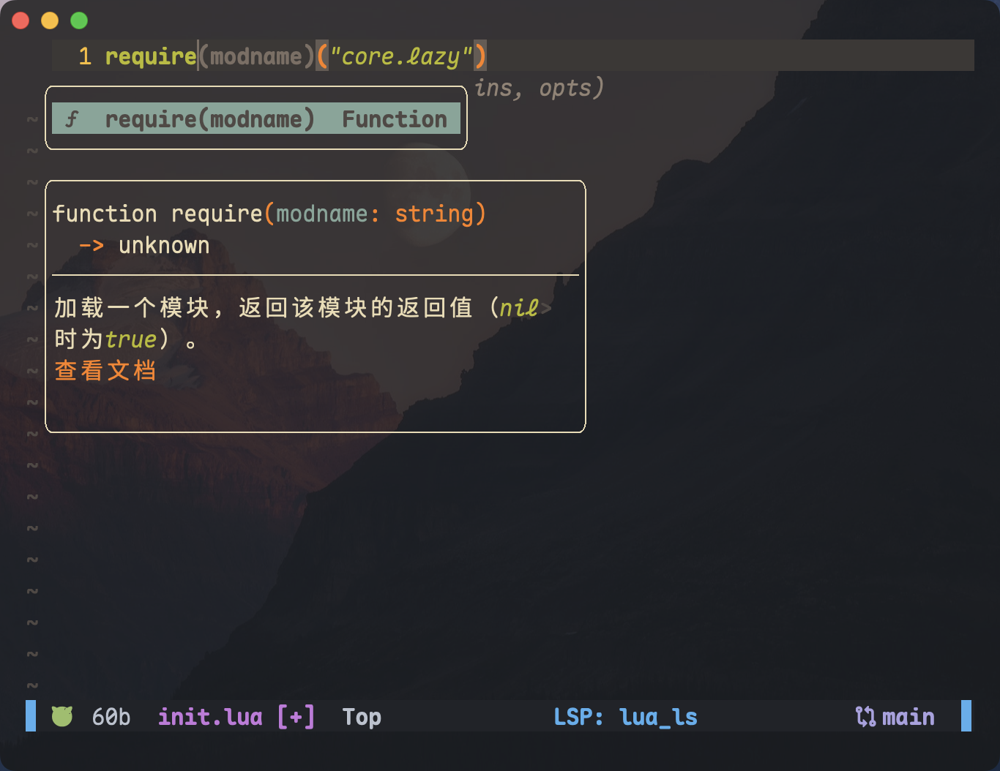
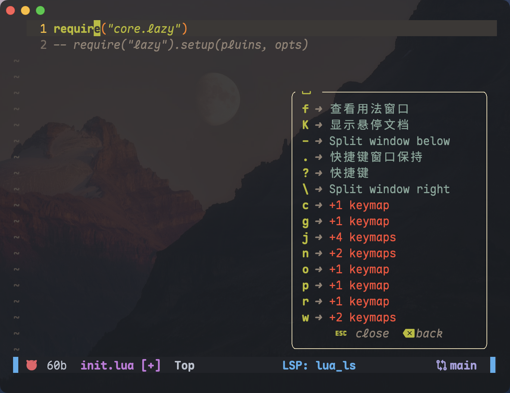

[](https://git.io/typing-svg)

---

:rainbow: 个人的 「**Nvim**」 配置方案，使用 [**lazy.nvim**](https://github.com/folke/lazy.nvim) :zzz: ​插件管理器。

 

<!-- markdown-toc GitLab -->

- [配置结构](#配置结构)
- [插件列表](#插件列表)
- [快捷键](#快捷键)

<!-- markdown-toc -->


## 配置结构

```dir
.
├── README.md
├── init.lua                 -- 配置入口
└── lua/                     -- LUA 配置目录
    ├── core/                -- 设置目录
    │   ├── autocmds.lua     -- 自动命令
    │   ├── keymaps.lua      -- 快捷键
    │   ├── lazy.lua         -- Lazy.nvim 安装
    │   └── options.lua      -- 常规配置
    └── plugins/             -- 插件配置目录
        ├── colorscheme.lua  -- 主题
        ├── configs/         -- 各个插件的配置目录
        ├── editor.lua       -- 代码工具
        ├── lsp.lua          -- 代码补全
        ├── ui.lua           -- ui 界面
        └── util.lua         -- 工具
```

## 插件列表

- ~~[onedark](https://github.com/navarasu/onedark.nvim) ：主题~~
- [gruvbox](https://github.com/ellisonleao/gruvbox.nvim)：主题 :evergreen_tree:（设置了透明背景）
- [alpha-nvim](https://github.com/goolord/alpha-nvim)：欢迎界面 :foggy:
- ~~[nvim-tree](https://github.com/nvim-tree/nvim-tree.lua)：文件树 :file_folder:~~
- [lualine](https://github.com/nvim-lualine/lualine.nvim)：状态栏
- ~~[bufferline](https://github.com/akinsho/bufferline.nvim)：缓冲区~~
- [gitsigns](https://github.com/lewis6991/gitsigns.nvim)：git 提示 :bulb:
- [vim-startuptime](https://github.com/dstein64/vim-startuptime)：查看 `nvim` 启动事件时间信息 :hourglass:
- ~~[nvim-notify](https://github.com/rcarriga/nvim-notify)：消息通知 :bell:~~
- ~~[toggleterm](https://github.com/akinsho/toggleterm.nvim)：内置终端~~
- [which-key](https://github.com/folke/which-key.nvim)：显示可用的快捷键弹出窗口 :mag:
- [noice](https://github.com/folke/noice.nvim)：替换了 `messages`、`cmdline` 和 `popupmenu` 的 UI
- [nvim-treesitter](https://github.com/nvim-treesitter/nvim-treesitter)：语法高亮 :vertical_traffic_light:
- ~~[nvim-autopairs](https://github.com/windwp/nvim-autopairs)：自动配对~~
- [guard](https://github.com/nvimdev/guard.nvim)：异步格式化和代码检查工具
- ~~[markview](https://github.com/OXY2DEV/markview.nvim)：Markdown 预览~~
- [render-markdown](https://github.com/MeanderingProgrammer/render-markdown.nvim)：Markdown 预览
- ~~[trouble](https://github.com/folke/trouble.nvim)：诊断列表~~
- ~~[mason](https://github.com/williamboman/mason.nvim)：LSP 管理~~
- ~~[mason-lspconfig](https://github.com/williamboman/mason-lspconfig.nvim)：连接 mason 和 lspconfig~~
- [nvim-lspconfig](https://github.com/neovim/nvim-lspconfig)：Nvim LSP 客户端的配置
- [lspsaga](https://github.com/nvimdev/lspsaga.nvim)：增强 LSP
- ~~[nvim-cmp](https://github.com/hrsh7th/nvim-cmp)：补全引擎插件~~
- [blink.cmp](https://github.com/Saghen/blink.cmp)：支持 LSP 和外部源的高校补全插件

删除了 Mason 系列，改用系统的包管理器来自己安装需要的 LSP 和 Formatter 等。

## 快捷键

| 模式   | 键                 | 说明 |
| ------ | ------------------ | ---- |
| normal | `<leader>` + ww |   |
| normal | `<leader>` + wd | 删除当前窗口（不能删除最后一个） |
| normal | `<leader>` + -  | 水平分屏 |
| normal | `<leader>` + \  | 垂直分屏 |
| normal | Ctrl + t  | 打开或关闭文件树 |
| normal | `<leader>` + t | 打开或关闭文件树 |
| normal | `<leader>` + tf | 聚焦到文件树上 |
| normal | `<leader>` + tc | 折叠文件树 |
| normal | `<leader>` + bp |  |
| normal | `<leader>` + mv | 打开或关闭 Markdown Preview |
| normal | `<leader>` + sf | 打开 Telescope 搜索文件 |
